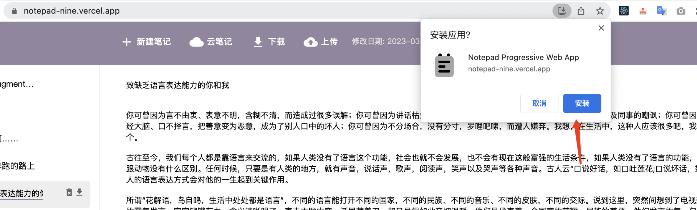
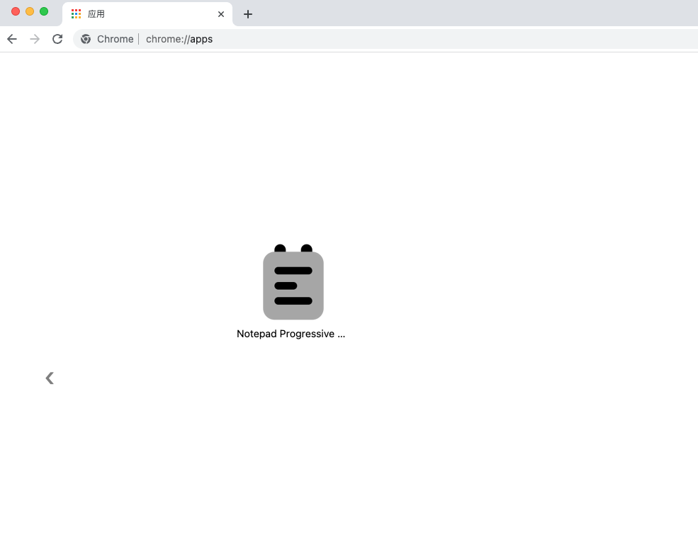
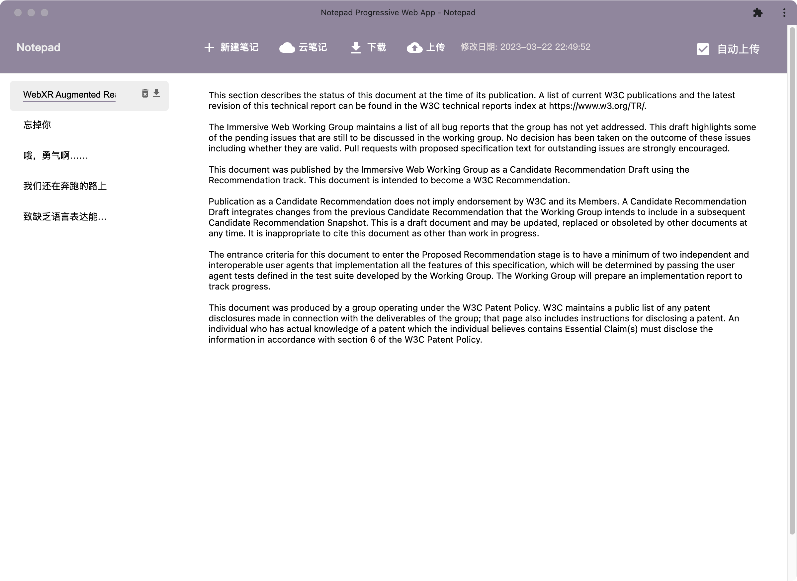
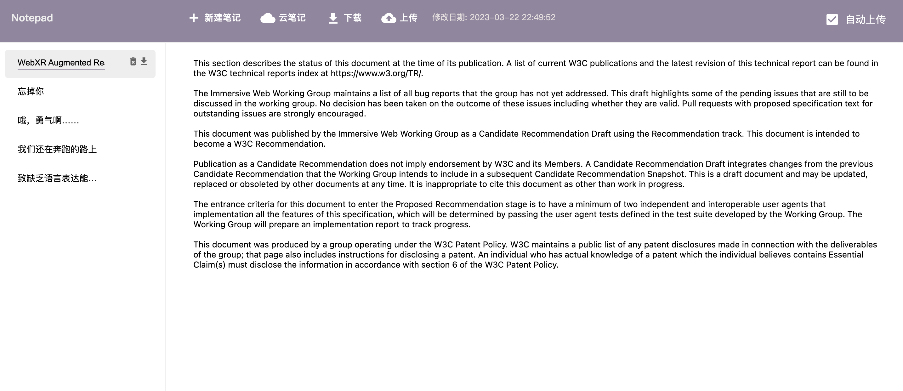
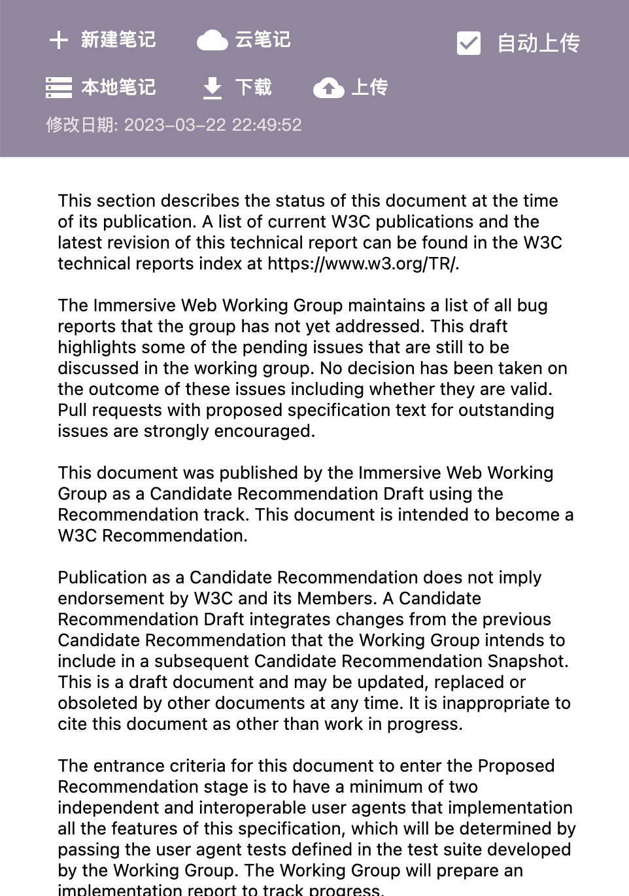
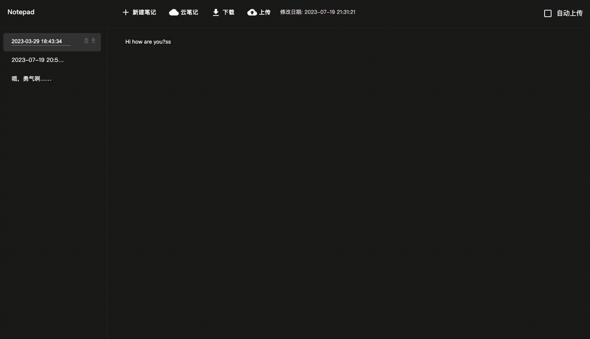

Notepad 是一个基于 Web 的轻量级笔记应用程序，支持本地离线存储、云端同步以及自动同步等功能。它采用现代化的技术栈：Next.js、React、Material-UI、Vercel Serverless Functions 和 PostgreSQL。


## 特性
* 轻量便捷: Notepad 是一个轻量级 Web 应用程序，无需安装即可在线使用。
* 离线可用: 用户可以在无网络的情况下访问 Notepad，并创建、编辑和查看笔记。
* 云端同步：用户可以将笔记保存在云端，并在多个设备之间同步。
* 笔记下载：用户可以下载已保存的笔记到本地，以便在没有网络连接时使用。
* 可配置自动同步: 用户可以选择是否开启笔记的自动同步功能。


## 技术栈
采用了现代化的技术栈，具体包括：

* 前端: Next.js、React、Material-UI。
* 后端: Vercel Serverless Functions、PostgreSQL。


## 开发
1. 在本地环境中运行后端应用程序所需的 MongoDB 数据库实例。
2. 在本地克隆应用程序的代码仓库。
3. 在代码仓库的根目录下运行 npm install 命令安装所有依赖。
4. 创建一个 .env 文件，并设置以下环境变量：
```.dotenv
ALLOW_USER_REGISTER=true # 是否允许用户注册
SESSION_SECRET=xxxxxxxxxxxxxxxx # session secret
POSTGRES_URL="postgres://<username>:<password>@<POSTGRES_URL>/<database>"

```
请确保将 POSTGRES_URL 替换为你的 PostgreSQL 数据库的实际 URL。
5. 迁移数据表
```bash
npm run migrations:migrate
```
6. 运行 npm run dev 命令启动开发服务器。
7. 访问 [http://localhost:3000](http://localhost:3000) 查看应用程序。


## 部署

### 在Vercel部署
1. 在 Vercel 中创建一个新的应用程序。
2. 将应用程序的代码仓库链接到 Vercel 应用程序。
3. 设置以下环境变量：
```
NODE_ENV=production
POSTGRES_URL=<你的 PostgreSQL 数据库 URI>
```
请将 POSTGRES_URL 替换为你的 PostgreSQL 数据库的实际 URI。
4. 迁移数据表
```bash
npm run migrations:migrate
```
5. 部署应用程序。


### 使用Docker部署
1. 创建volume
```bash
docker volume create postgres-db
```
2. 启动容器
```bash
docker compose up -d
```

3. 迁移数据表
```bash
docker exec notepad-pwa-notepad-1 npm run migrations:migrate
```


## 安装

1. 访问网址 [https://notepad-nine.vercel.app/](https://notepad-nine.vercel.app/)

2. 在右上角会出现一个安装提示，点击它安装应用。

3. 安装完成后，应用会自动打开。你可以在 Chrome 浏览器的“应用”页面中查看已安装的应用。



## 截图
Web


移动端



暗色

